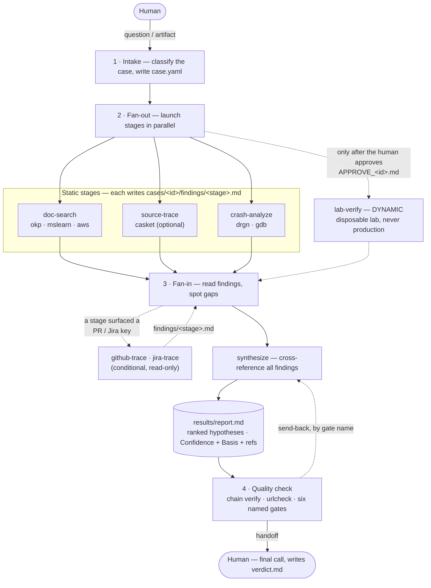
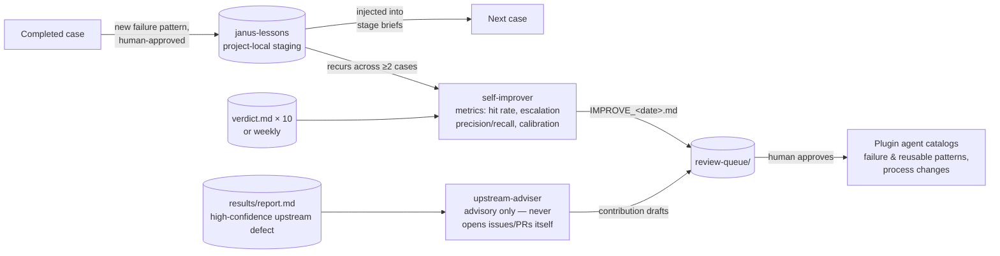

# JANUS — Claude Code plugin

> **Janus**, the Roman god of gates, has two faces looking in opposite
> directions — and so does this pipeline. One face looks **downstream**,
> where an OpenShift consultant works: the exact RHEL/OCP builds
> customers run, their crashes, upgrades, and CVEs. The other looks
> **upstream**, where the fix belongs: the kernel, Kubernetes, and
> KubeVirt communities. Dig deep enough into Linux and the two views
> meet at the same root cause.

An OpenShift / RHEL / CNV **research & investigation pipeline** for
Claude Code — case types range from kernel crash forensics to
upgrade/compatibility analysis, CVE impact assessment, and
operator/component behavior investigation. JANUS uses Claude Code itself as
the orchestrator: the lead session composes a pipeline of small agent stages
per case type, gates the dynamic ones, and
hands a ranked-hypothesis report to a human. It lays evidence and hypotheses on
the table — the human makes the final call.

Every case feeds both faces: `synthesize` hands the consultant a
ranked-hypothesis report grounded in the exact builds involved, and when
the root cause turns out to be everyone's problem, `upstream-adviser`
drafts the contribution proposal to carry it home.

## Architecture

How a case flows through the team — the lead session orchestrates,
small agent stages investigate in parallel, and the human holds every
gate that matters:



And how JANUS improves itself — two periodic agents sit outside the
pipeline and feed a human-gated review queue:



## What's in the plugin

```
.claude-plugin/marketplace.json      # marketplace listing → plugins/janus
plugins/janus/
  .claude-plugin/plugin.json         # plugin manifest
  skills/janus/SKILL.md              # /janus — pipeline driver
  skills/janus/scripts/chain.py      # per-case evidence hash ledger (seal/verify)
  skills/janus/scripts/urlcheck.py   # reference-URL liveness check (backs gate G2-URL)
  skills/deck/                       # report → branded .pptx/PDF
  skills/okp-doc-search/             # okp-mcp research know-how (queries, doc_id rules)
  hooks/                             # secret-safety (PreToolUse denies) + evidence-chain (PostToolUse auto-seal)
  agents/                            # 9 agents (patterns inlined into each)
    doc-search  source-trace  github-trace  jira-trace  crash-analyze
    lab-verify  synthesize  self-improver  upstream-adviser
scripts/validate.py                  # repo consistency checks (CI-friendly, stdlib-only)
scripts/selftest.py                  # offline self-tests for chain.py / urlcheck.py
.github/workflows/ci.yml             # runs both on every push / PR
```

The pipeline: `{ doc-search, source-trace, crash-analyze, [approve] lab-verify } | synthesize`
— seven composable stages connected by a universal `findings/*.md` format
(github-trace and jira-trace join conditionally when another stage surfaces
an upstream PR/issue or a Jira ticket), plus two periodic agents. Reusable investigation patterns (drgn triage, CVE tracing,
refuting an a-priori hypothesis, goroutine-leak repro, etc.) are **inlined into
each agent** so they travel with the plugin.

## Install

This repo is itself a Claude Code plugin marketplace
(`.claude-plugin/marketplace.json`). Inside a Claude Code session:

```
/plugin marketplace add nogunix/janus   # register straight from GitHub
/plugin install janus@janus             # install the plugin (plugin@marketplace)
```

Or from a local clone (useful when editing the plugin):

```bash
git clone https://github.com/nogunix/janus.git ~/janus
```

```
/plugin marketplace add ~/janus     # register the local marketplace
/plugin install janus@janus         # install the plugin (plugin@marketplace)
```

When editing the plugin, run `python3 scripts/validate.py` before
committing — it checks manifest schema, skill/agent frontmatter,
hook-script paths, and SKILL.md ↔ agents/ stage sync.

Submitted to Anthropic's community marketplace for review; once approved
it will also be installable via `/plugin marketplace add
anthropics/claude-plugins-community` → `janus@claude-community`. Until
then, use the direct-from-GitHub install above — it already tracks the
latest release.

Restart Claude Code so the skills and agents load, then verify:

- `/plugin` — `janus` shows as installed and enabled
- `/janus` appears in the skill list; the nine `janus:*` agents appear in
  the Agent tool list

Day-to-day maintenance:

```
/plugin marketplace update janus    # re-read the local clone after edits
/plugin uninstall janus@janus       # remove the plugin
/plugin marketplace remove janus    # remove the marketplace entry
```

## Working method (model-agnostic quality)

Investigation quality is enforced by explicit discipline, not by the
model in the seat:

- **Evidence-basis labels** — every finding carries
  `Basis: VERIFIED | REASONED | ASSUMED` (tool output observed vs.
  inferred from reading vs. carried in) alongside its confidence, and a
  label is only promoted by new evidence.
- **Named acceptance gates** — the lead checks each report against six
  named gates (references, public URLs, no speculation language, basis
  integrity, completeness, verbatim artifact names) and sends failures
  back to synthesize by gate name; a HIGH hypothesis needs at least one
  VERIFIED finding behind it. Two of these checks are mechanical —
  reference liveness and the evidence chain (see **Integrity checks**
  below).
- **Causation gate** — crash-analyze may not record a crash cause
  without "X causes Y because Z" where X and Y are observations from
  this vmcore; correlation without a mechanism caps at MEDIUM.
- **Failure-pattern catalogs** — agents carry
  `symptom → wrong move → correct move` entries seeded from real cases
  (e.g. a search timeout means "reduce scope", never "report negative").
- **Lessons loop** — project-specific lessons are banked (with human
  approval) in `.claude/skills/janus-lessons/SKILL.md`, which plugin
  updates never overwrite; the lead injects relevant entries into stage
  briefs, and recurring ones get promoted into the plugin's own
  catalogs via the self-improver review queue.

### Integrity checks (mechanical, before any human-level gate)

Two stdlib-only scripts turn "trust the report" into "check the report."
Both run at handoff; a failure sends the report back rather than shipping
it.

**Evidence chain — `scripts/chain.py`.** Each case carries an
append-only hash ledger, `cases/<id>/chain.jsonl`. Every record holds
the sha256 of one evidence file plus the previous record's hash — the
same linked-hash idea as a blockchain. It makes edits **visible, never
impossible**: a legitimate revision (a report sent back to synthesize,
an updated finding) appends a new record and the ledger keeps the full
history; an edit that bypasses sealing breaks verification.

```
$ python3 scripts/chain.py verify cases/<id>
FAIL: TAMPER: results/report.md changed after last seal
```

Sealing is mostly automatic — a PostToolUse hook
(`hooks/evidence-chain.py`) seals every write into the evidence set
(`case.yaml`, findings, report, audit logs, verdict) — and the lead
also seals explicitly before synthesis and at close (covering
shell-written files the hook can't see). Deleting a record to cover
tracks fails too: the broken hash link exposes the gap. The upshot is
that the audit trail behind a claim can't be quietly rewritten after
the fact, and the human verdicts self-improver's metrics stand on stay
ground truth.

**Reference liveness — `scripts/urlcheck.py`.** Backs gate G2-URL by
curl-checking every reference URL in the report. A fabricated citation
(the classic LLM failure) dies as a 404 instead of a footnote nobody
clicked:

```
$ python3 scripts/urlcheck.py cases/<id>/results/report.md
FAIL: https://access.redhat.com/errata/RHSA-2099:9999/ (404)
```

The check is deliberately honest about what it can't prove. A portal
that 302-redirects a missing path into an SSO login flow (returns 200)
is classified **gated**, not live — existence unconfirmable without
authenticating, so it's flagged for a human rather than passed or
failed. 401/403/429 fold into the same class. A fully-unreachable
network downgrades to a notice and passes, so air-gapped okp-mcp
installs stay usable.

Both scripts have offline self-tests (`scripts/selftest.py`) exercising
tamper detection, ledger-edit detection, and the gated-vs-dead URL
split; `.github/workflows/ci.yml` runs them with `validate.py` on every
push and PR.

See [CHANGELOG.md](CHANGELOG.md) for version history.

## Usage

Invoke `/janus` with a question or an artifact. The lead classifies the
case, shows you the pipeline it intends to run, fans the stages out on
approval, and hands you a ranked-hypothesis report at
`cases/<id>/results/report.md`.

**CVE impact assessment** (needs okp-mcp):

```
/janus Does CVE-2024-1086 affect OpenShift 4.16 worker nodes?
```

→ `{ doc-search, source-trace } | synthesize` — errata/KB sweep plus the
actual code path, cross-referenced into ranked hypotheses. A
well-supported "not affected, and here is why" is a valid outcome.

**Kernel crash forensics** (needs drgn):

```
/janus Analyze the vmcore under cases/2026-07-11-node-panic/artifacts/,
kernel 5.14.0-570.el9. The node panicked during a VM live migration.
```

→ adds `crash-analyze`: drgn triage (crashed thread, dmesg, task states),
then up to 5 observe → hypothesize → probe rounds. Every probe and its
output lands in `cases/<id>/audit/` — the report's claims point at them.

**Upgrade / cross-version compatibility**:

```
/janus What changed between OCP 4.18 and 4.20 that could break VMs
using SCSI-3 persistent reservations over multipath?
```

→ version-diff investigation across layers (kernel, RHEL userspace,
CNV). When a stage surfaces a KubeVirt PR or an `RHEL-NNNNN` ticket it
cannot open, the lead launches `github-trace` / `jira-trace` follow-ups
at fan-in. For ARO cases, mslearn covers the Azure layer; for ROSA cases,
the AWS MCP servers cover the AWS layer.

Japanese prompts work the same way — the skill triggers on phrases like
「vmcoreを解析」「OOM調査」「アップグレード互換性を調査」「CVEの影響評価」.

Every finding in the report carries **Confidence + Basis
(VERIFIED / REASONED / ASSUMED) + a reference a human can open** — a
CVE/errata URL, a source permalink, or a drgn audit log. Live-cluster
verification (`lab-verify`) is only ever *proposed*: it runs on a
disposable lab, and only after you approve
`review-queue/APPROVE_<id>.md`.

## MCP dependencies (environment-specific)

The plugin does not bundle MCP config — server paths are machine-specific.
Register each server yourself (`claude mcp add …`) before running an
investigation, then confirm `claude mcp list` shows `✔ Connected` — a tool
being advertised isn't the same as the server being reachable.

### okp-mcp — Red Hat docs / CVE / errata / KB
Bridges to the official **Offline Knowledge Portal** (OKP) Solr index.
Requires a Red Hat account (`registry.redhat.io` access + an OKP access key
from <https://access.redhat.com/offline/access/>). The bridge server itself
is public OSS: <https://github.com/rhel-lightspeed/okp-mcp>.

```bash
podman login registry.redhat.io        # needs a Red Hat account
# build the okp-mcp bridge image per github.com/rhel-lightspeed/okp-mcp
podman play kube okp-pod.yaml          # manifest below
claude mcp add --transport http okp-mcp http://localhost:8000/mcp --scope user
```

`okp-pod.yaml` — Solr + bridge in one pod:
```yaml
apiVersion: v1
kind: Pod
metadata:
  name: okp-mcp
spec:
  containers:
    - name: redhat-okp
      image: registry.redhat.io/offline-knowledge-portal/rhokp-rhel9:latest
      ports:
        - containerPort: 8983
          hostPort: 8983
      env:
        - name: ACCESS_KEY
          value: "<your-okp-access-key>"
        - name: SOLR_JETTY_HOST
          value: "0.0.0.0"
      volumeMounts:
        - name: redhat-okp-data
          mountPath: /opt/solr/server/solr/portal/data
    - name: okp-mcp
      image: localhost/okp-mcp:latest
      ports:
        - containerPort: 8000
          hostPort: 8000
      env:
        - name: MCP_SOLR_URL
          value: "http://localhost:8983"
  volumes:
    - name: redhat-okp-data
      persistentVolumeClaim:
        claimName: redhat-okp-data
  restartPolicy: Always
```

### mslearn — Microsoft Learn docs for the ARO/Azure layer
Public remote server, no auth, used by doc-search. Official server docs:
<https://github.com/MicrosoftDocs/mcp>.
```bash
claude mcp add --transport http mslearn https://learn.microsoft.com/api/mcp
```

### aws-docs / aws-knowledge / aws-support — AWS docs for the ROSA/AWS layer
The AWS mirror of mslearn, used by doc-search for **ROSA (Red Hat OpenShift
Service on AWS)** and the AWS services beneath it. All optional, from
[awslabs/mcp](https://github.com/awslabs/mcp); doc-search uses whichever are
connected and skips the rest.

- **aws-knowledge** — hosted, read-only, no auth; cross-searches AWS docs /
  blogs / What's New / API references:
  ```bash
  claude mcp add --transport http aws-knowledge https://knowledge-mcp.global.api.aws
  ```
- **aws-docs** — read-only, no credentials; runs via `uvx`:
  ```bash
  claude mcp add aws-docs -- uvx awslabs.aws-documentation-mcp-server@latest
  ```
- **aws-support** — needs AWS credentials + a Business/Enterprise support
  plan. **Only its read-only `describe_*` tools are granted** to doc-search
  (the case create / reply / resolve tools are deliberately withheld — JANUS
  never mutates a support case):
  ```bash
  claude mcp add aws-support --env AWS_PROFILE=<profile> --env AWS_REGION=us-east-1 \
    -- uvx awslabs.aws-support-mcp-server@latest
  ```

### slack — optional, bring your own workspace
doc-search can supplement official docs with your team's Slack
discussions. It calls the tools of
[redhat-community-ai-tools/slack-mcp](https://github.com/redhat-community-ai-tools/slack-mcp)
(`search_messages`, `get_thread`, `get_channel_history`,
`list_joined_channels`, …), which runs locally via Podman/Docker
(`quay.io/redhat-ai-tools/slack-mcp`) or its one-shot setup script.
Register it with **`SLACK_MCP_READ_ONLY=1`** so state-mutating tools
(post/react/join) error out — JANUS only reads. Point it at a workspace
you are authorized to search. Slack hits are supplementary evidence
only — findings attribute them as `[slack] #channel, YYYY-MM-DD` and
never rest a conclusion on them alone. Without it, doc-search simply
skips the Slack angle.

### mcp-atlassian — optional, Jira ticket deep-dive
Used by the conditional `jira-trace` stage when another stage surfaces a
Jira ticket key (e.g. Red Hat Jira `RHEL-NNNNN` / `OCPBUGS-NNNNN`).
Public OSS: <https://github.com/sooperset/mcp-atlassian>. **Register it
with `READ_ONLY_MODE=true`** — that disables every write tool at server
level and is the safety boundary that keeps jira-trace observation-only
(JANUS never creates, edits, comments on, or transitions tickets):
```bash
claude mcp add mcp-atlassian -s user \
  --env JIRA_URL=https://issues.redhat.com \
  --env JIRA_PERSONAL_TOKEN=<your-PAT> \
  --env READ_ONLY_MODE=true \
  -- uvx mcp-atlassian
```
For Jira Cloud, use `JIRA_USERNAME` + `JIRA_API_TOKEN` instead of the
personal access token. Without this server, jira-trace is skipped and
ticket references stay in the report as gaps.

### drgn — vmcore static analysis
Public OSS: <https://github.com/walac/drgn-mcp>, an MCP wrapper around
the [drgn](https://github.com/osandov/drgn) programmable kernel
debugger. Run it sandboxed — network-cut, read-only, unprivileged —
since upstream has no built-in sandboxing:
```bash
git clone https://github.com/walac/drgn-mcp.git
cd drgn-mcp && python3 -m venv .venv && .venv/bin/pip install -e .
claude mcp add drgn -s user -- "$(pwd)/.venv/bin/python" -m drgn_mcp.server
```

### github — upstream PR/issue/commit lookup
Official hosted read-only endpoint of
[github/github-mcp-server](https://github.com/github/github-mcp-server)
— no server to run yourself. The `/readonly` path serves only read
tools, which is the safety boundary here. Used by github-trace and
upstream-adviser:
```bash
claude mcp add --transport http github https://api.githubcopilot.com/mcp/readonly
```

### linux — read-only RHEL node/VM diagnostics
Public OSS: <https://github.com/rhel-lightspeed/linux-mcp-server>,
local or over SSH. Used by lab-verify. Register with `LINUX_MCP_TOOLSET=fixed` (lowercase) so the
arbitrary-script `run_script` toolset stays disabled — that's the safety
boundary that keeps lab-verify read-only:
```bash
pip install git+https://github.com/rhel-lightspeed/linux-mcp-server.git
claude mcp add linux -s user --env LINUX_MCP_TOOLSET=fixed -- linux-mcp-server
```

## Safety

Read-only. Dead-artifact analysis (vmcore) is autonomous-safe; live-target work
(lab provisioning, dynamic tracing) requires explicit human approval and a
disposable lab, never production. Never spoofs guardrails; the final
root-cause call is the human's.

## License

MIT License - see the [LICENSE](LICENSE) file for details.

This is my personal project. It is created and maintained in my
personal capacity, and has no relation to my employer's business or
confidential information.
